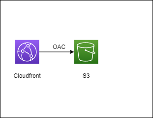

# S3 + CloudFront 静的ウェブサイトホスティング

## アーキテクチャ

## 概要
[AWS Workshop](https://catalog.us-east-1.prod.workshops.aws/workshops/a9b0eefd-f429-4859-9881-ce3a7f1a4e5f/ja-JP/step1-webhosting)を参照してWEBサイトをホスティングしますが、WorkshopではConsoleで操作してますが、CDKで構築します。

### 主な機能
- CloudFrontによるコンテンツのグローバル配信
- S3による静的コンテンツのホスティング
- Origin Access Control (OAC)によるセキュアなアクセス制御

